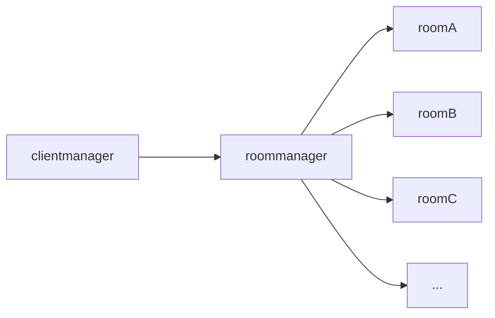
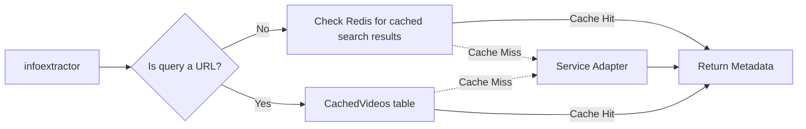

## Overview

OpenTogetherTube uses a hybrid architecture combining TypeScript/JavaScript for the web application with Rust for high-performance load balancing. The system is designed for horizontal scalability and real-time synchronization.

### Major Components

There are three major components:

1. **The Monolith** - Node.js/Express server written in TypeScript
2. **The Client** - Vue 3 web application written in TypeScript
3. **The Balancer** - Rust-based load balancer (not currently deployed in production)

## Monorepo Structure

The project uses a monorepo architecture with Yarn workspaces and Cargo:

```
opentogethertube/
├── client/                    # Vue 3 frontend
├── server/                    # Node.js backend (monolith)
├── common/                    # Shared TypeScript code
├── crates/                    # Rust workspace
│   ├── ott-balancer/         # Load balancer library
│   ├── ott-balancer-bin/     # Binary executable
│   ├── ott-balancer-protocol/# Protocol definitions
│   ├── ott-collector/        # Metrics collection service
│   ├── ott-common/           # Shared Rust utilities
│   └── harness/              # Integration test harness
└── packages/                  # Grafana plugins
    ├── ott-vis/              # Shared visualization types
    ├── ott-vis-panel/        # Panel plugin (React + D3)
    └── ott-vis-datasource/   # Datasource plugin
```

## Room Management Architecture

To support horizontal scaling, OpenTogetherTube separates client connection management from room state management.

### Component Interaction



### Key Components

**Client Manager**
- Manages all WebSocket connections from clients
- Relays messages between clients and rooms
- Broadcasts room events to subscribed clients

**Room Manager**
- Manages room lifecycle and state
- Coordinates with the Balancer to prevent duplicate room instances across different Monoliths
- Ensures room state consistency

**Room**
- Individual room instance that maintains its own state
- Emits events for state changes (playback, queue updates, etc.)
- Handles room-specific business logic

### Client-Room Communication Flow

1. Client connects via WebSocket to the Client Manager
2. Client requests to join a room
3. Client Manager subscribes the client to room events
4. Room emits state change events
5. Client Manager receives events and broadcasts to subscribed clients

This architecture allows multiple Monoliths to handle different rooms while preventing the same room from being loaded on multiple servers.

## Info Extractor Pipeline

The Info Extractor is responsible for extracting and caching media metadata from various video services.

### High-Level Pipeline



### Service Adapters

Each video service has its own adapter that inherits from the `ServiceAdapter` base class. Adapters are located in `server/services/`.

**Supported Services:**
- YouTube (and Invidious)
- Vimeo
- Google Drive
- Reddit
- PeerTube
- Odysee
- PlutoTV
- Tubi
- Direct video URLs
- HLS/DASH streams

### Metadata Collection

The pipeline collects comprehensive metadata including:

- Title
- Description
- Thumbnail
- Duration
- Service-specific metadata

### Caching Strategy

**Video Metadata Caching:**
- Stored in the `CachedVideos` database table
- Cache lifetime: 30 days
- Automatically refreshed when stale

**Search Results Caching:**
- Stored in Redis with query as the key
- Cache lifetime: 24 hours
- Not cached for playlists

**Direct Videos:**
- Not cached to prevent storage bloat

### Cache Invalidation

When cache entries expire, the pipeline automatically refreshes the metadata on the next request, ensuring users always receive up-to-date information.

## Load Balancer (Rust)

The load balancer is a high-performance Rust application designed to route WebSocket connections and HTTP requests across multiple Monolith instances.

### Architecture

**Components:**

- `ott-balancer` - Core balancer library implementing routing logic
- `ott-balancer-bin` - Executable binary for deployment
- `ott-balancer-protocol` - Shared protocol definitions between Balancer and Monoliths
- `ott-collector` - Metrics collection service for monitoring
- `ott-common` - Shared Rust utilities and types
- `harness` - Integration test harness for load balancer testing

### Key Features

**Room Affinity:**
- Ensures all connections to the same room route to the same Monolith
- Prevents duplicate room state across servers
- Uses consistent hashing for room assignment

**WebSocket Proxying:**
- Low-latency WebSocket connection forwarding
- Connection state tracking
- Automatic reconnection handling

**HTTP Request Routing:**
- Intelligent routing based on request type
- Support for health checks and metrics endpoints

**Running the Balancer:**

```bash
cargo run -p ott-balancer-bin -- --config env/balancer.toml
```

<Note>
The load balancer is not currently deployed in production but is fully functional for local development and testing.
</Note>

## Technology Stack

### Frontend (Client)

- **Framework:** Vue 3 with Composition API
- **Build Tool:** Vite
- **UI Library:** Vuetify 3
- **State Management:** Vuex 4
- **Video Players:** Plyr, HLS.js, dash.js
- **Language:** TypeScript

### Backend (Server)

- **Runtime:** Node.js 20-22
- **Framework:** Express.js
- **WebSocket:** ws library
- **Database ORM:** Sequelize
- **Caching:** Redis
- **Authentication:** Passport.js
- **Validation:** Zod
- **Language:** TypeScript

### Load Balancer

- **Language:** Rust (2021 edition)
- **HTTP:** Hyper + Tokio
- **WebSocket:** Tokio-Tungstenite
- **Configuration:** Figment (TOML)
- **Metrics:** Prometheus
- **Error Handling:** anyhow + thiserror

### Monitoring

- **Metrics:** Prometheus
- **Visualization:** Grafana with custom plugins
- **Plugins:** React + D3.js

## Data Flow

### Real-Time Synchronization

1. User performs action (play, pause, seek)
2. Client sends WebSocket message to Monolith
3. Monolith validates and processes the action
4. Room state updates
5. Room emits event to Client Manager
6. Client Manager broadcasts to all connected clients in the room
7. Clients update their local state and video players

### Video Addition Flow

1. User submits a video URL or search query
2. Request sent to Info Extractor
3. Info Extractor checks cache (Redis/Database)
4. If cache miss, appropriate Service Adapter is invoked
5. Metadata retrieved and cached
6. Video added to room queue
7. Queue update event broadcast to all clients

## Security Considerations

- **Authentication:** Session-based with Redis storage
- **API Rate Limiting:** Implemented using rate-limiter-flexible
- **Input Validation:** Zod schemas for runtime validation
- **CORS:** Configured for allowed origins
- **Password Hashing:** Argon2 algorithm

## Scalability

### Horizontal Scaling

- Multiple Monolith instances behind load balancer
- Room affinity ensures consistent state
- Redis session sharing across instances

### Database

- PostgreSQL for production (supports concurrent connections)
- SQLite for development and testing
- Sequelize migrations for schema management

### Caching Strategy

- Redis for session storage and search result caching
- Database for persistent video metadata caching
- Two-tier cache minimizes external API calls

## Future Architecture Improvements

- Deploy Rust load balancer to production
- Implement distributed room state using Redis pub/sub
- Microservices architecture for info extraction
- GraphQL API for more efficient client-server communication
