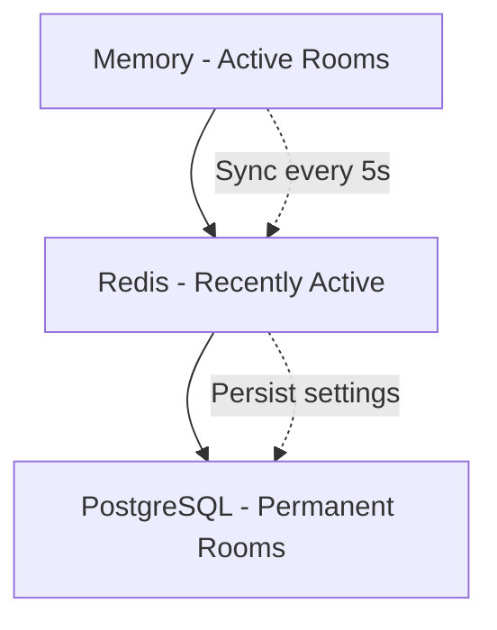

Rooms are the core of OpenTogetherTube. Each room provides a shared synchronized video experience where multiple users can watch videos together in real-time.

## Room Types

OpenTogetherTube supports two types of rooms:

<CardGroup cols={2}>
  <Card title="Temporary Rooms" icon="clock">
    Auto-generated UUID-based rooms that expire after inactivity. Perfect for quick watch sessions.
  </Card>
  <Card title="Permanent Rooms" icon="bookmark">
    Named rooms that persist in the database. Can be claimed by registered users for full control.
  </Card>
</CardGroup>

## Creating Rooms

### Generate a Temporary Room

Temporary rooms are created with auto-generated UUIDs and don't require an account:

```typescript
POST /api/room/generate

{
  "title": "Movie Night",
  "description": "Watching classics together",
  "visibility": "unlisted",
  "queueMode": "manual"
}
```

**Response:**
```json
{
  "success": true,
  "room": "550e8400-e29b-41d4-a716-446655440000"
}
```

### Create a Permanent Room

Permanent rooms have custom names and persist in the database:

```typescript
POST /api/room/create

{
  "name": "my-awesome-room",
  "title": "My Awesome Room",
  "isTemporary": false,
  "visibility": "public",
  "queueMode": "vote"
}
```

<Note>
  Room names must be 3-32 characters, alphanumeric with hyphens, and globally unique.
</Note>

## Room Properties

Rooms maintain the following state:

| Property | Type | Description |
|----------|------|-------------|
| `name` | string | Unique identifier for the room |
| `title` | string | Display title shown to users |
| `description` | string | Room description |
| `visibility` | enum | `public`, `unlisted`, or `private` |
| `queueMode` | enum | How videos are queued (manual, vote, loop, dj) |
| `currentSource` | QueueItem | Currently playing video |
| `queue` | VideoQueue | Upcoming videos |
| `isPlaying` | boolean | Playback state |
| `playbackPosition` | number | Current position in seconds |
| `playbackSpeed` | number | Playback speed multiplier (default: 1.0) |
| `owner` | User | Room owner (can be null) |

## Room Lifecycle

### Loading

Rooms are loaded on-demand when users connect:

1. **Check in-memory cache** - If already loaded in RoomManager
2. **Check Redis** - Restore from Redis if recently active
3. **Check database** - Load from permanent storage
4. **Create new** - Initialize a fresh room instance

```typescript
const result = await roommanager.getRoom(roomName);
if (result.ok) {
  const room = result.value;
}
```

### Unloading

Rooms unload automatically when:

- No users connected for the configured timeout period
- Explicitly commanded by admin
- Server shutdown

**Before unloading**, rooms save their state:

```typescript
async onBeforeUnload() {
  // Save full state to Redis
  await this.saveStateToRedisDebounced.flush();
  
  // Save current queue to resume later
  if (!this.isTemporary) {
    const prevQueue = this.queue.items;
    if (this.currentSource) {
      prevQueue.unshift({
        ...this.currentSource,
        startAt: this.realPlaybackPosition
      });
    }
    await storage.updateRoom({
      name: this.name,
      prevQueue: prevQueue.length > 0 ? prevQueue : null
    });
  }
}
```

## Room Settings

Users with appropriate permissions can modify room settings:

### Visibility Options

<Tabs>
  <Tab title="Public">
    Visible in the public room list. Anyone can join.
  </Tab>
  <Tab title="Unlisted">
    Not listed publicly, but accessible via direct link.
  </Tab>
  <Tab title="Private">
    Restricted access (future feature).
  </Tab>
</Tabs>

### Queue Modes

<AccordionGroup>
  <Accordion title="Manual Mode" icon="hand">
    Videos play in the order they were added. Room moderators control playback.
  </Accordion>
  
  <Accordion title="Vote Mode" icon="check-to-slot">
    Queue automatically reorders based on user votes. Most voted videos play first.
  </Accordion>
  
  <Accordion title="Loop Mode" icon="rotate">
    Videos are re-queued after playing, creating an infinite loop.
  </Accordion>
  
  <Accordion title="DJ Mode" icon="record-vinyl">
    Current video restarts when finished. Perfect for music sessions.
  </Accordion>
</AccordionGroup>

## Room Ownership

### Claiming Ownership

Rooms without owners can be claimed by registered users:

```typescript
PATCH /api/room/:name

{
  "claim": true
}
```

**Benefits of ownership:**
- Full permission control
- Promote/demote users to roles
- Configure advanced settings
- Permanently delete the room

<Warning>
  Room ownership is permanent and cannot be transferred. Choose wisely!
</Warning>

## Persistence

Rooms use a three-tier storage strategy:



### What's Stored Where

| Storage | Data | TTL |
|---------|------|-----|
| **Memory** | Full room state, users, queue, playback | Until unloaded |
| **Redis** | Serialized room state | Configurable (default: 1 hour) |
| **Database** | Settings, permissions, ownership | Permanent |

## API Reference

### Get Room Info

```http
GET /api/room/:name
```

Returns complete room state including queue, users, and settings.

### Update Room Settings

```http
PATCH /api/room/:name

Content-Type: application/json
{
  "title": "New Title",
  "queueMode": "vote",
  "enableVoteSkip": true
}
```

### Delete Room

```http
DELETE /api/room/:name?permanent=true
```

<Info>
  Only room owners can permanently delete permanent rooms. Admin API key can unload any room.
</Info>

## Implementation Details

### Room Class Structure

The `Room` class (located at `server/room.ts:222`) implements the core room logic:

```typescript
export class Room implements RoomState {
  // Getters/setters automatically mark properties as dirty
  public set title(value: string) {
    this._title = value;
    this.markDirty("title"); // Triggers sync to clients
  }
  
  // Process user requests with permission checking
  async processRequest(request: RoomRequest, context: RoomRequestContext) {
    const permission = permissions.get(request.type);
    if (permission) {
      this.grants.check(context.role, permission);
    }
    // Handle request...
  }
}
```

### State Synchronization

Rooms automatically sync state changes to all connected clients:

```typescript
private markDirty(prop: keyof RoomStateSyncable): void {
  this._dirty.add(prop);
  this.throttledSync(); // Debounced sync (50ms)
}

public async sync(): Promise<void> {
  const msg: ServerMessageSync = {
    action: "sync",
    ..._.pick(this.syncableState(), Array.from(this._dirty))
  };
  await this.publish(msg); // Broadcast to all clients
}
```

## Best Practices

<Steps>
  <Step title="Choose the Right Room Type">
    Use temporary rooms for one-time events, permanent rooms for recurring sessions.
  </Step>
  
  <Step title="Set Appropriate Visibility">
    Start with `unlisted` for private groups, use `public` for community rooms.
  </Step>
  
  <Step title="Configure Queue Mode">
    Match queue mode to your use case: `vote` for democratic control, `manual` for moderated content.
  </Step>
  
  <Step title="Claim Ownership Early">
    Claim permanent rooms immediately to prevent others from taking ownership.
  </Step>
</Steps>

## Related Features

<CardGroup cols={2}>
  <Card title="Permissions" icon="shield" href="/features/permissions">
    Configure who can control playback and manage the room
  </Card>
  <Card title="Video Sync" icon="arrows-rotate" href="/features/video-sync">
    Learn how real-time synchronization works
  </Card>
  <Card title="Vote Mode" icon="square-poll-vertical" href="/features/voting">
    Democratic queue management
  </Card>
  <Card title="SponsorBlock" icon="forward" href="/features/sponsorblock">
    Automatic sponsor segment skipping
  </Card>
</CardGroup>