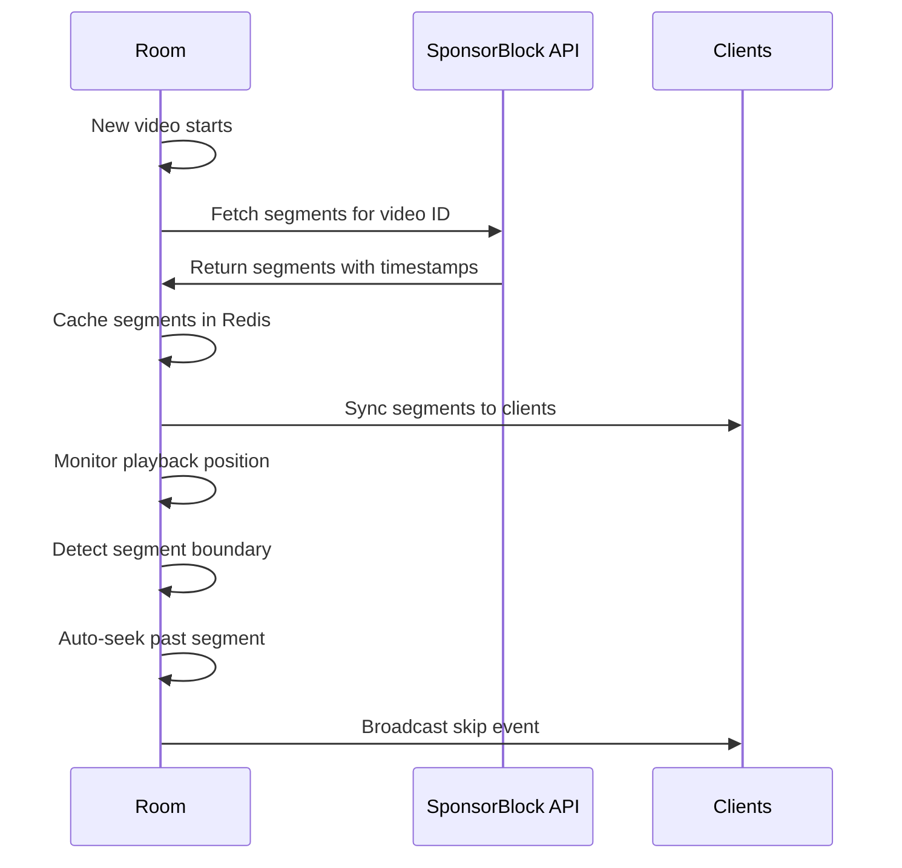

OpenTogetherTube integrates with [SponsorBlock](https://sponsor.ajay.app/) to automatically skip unwanted segments in YouTube videos, including sponsors, intros, outros, and more.

## What is SponsorBlock?

SponsorBlock is a crowdsourced database of video segments that users want to skip. Community members submit timestamps for:

- Sponsor segments
- Unpaid/self promotions
- Interaction reminders (like/subscribe)
- Intro animations
- Outro credits
- Preview/recap segments
- Non-music portions of music videos
- Filler content

## How It Works



## Enabling SponsorBlock

### Server Configuration

Enable SponsorBlock in your server config:

```toml
# env/development.toml
[video.sponsorblock]
enabled = true
cache_ttl = 86400  # 24 hours in seconds
```

### Room Configuration

Room owners can configure which segment categories to auto-skip:

```http
PATCH /api/room/:name

Content-Type: application/json
{
  "autoSkipSegmentCategories": [
    "sponsor",
    "selfpromo",
    "interaction",
    "intro",
    "outro"
  ]
}
```

## Segment Categories

All available categories are defined in `common/constants.ts`:

```typescript
export const ALL_SKIP_CATEGORIES = [
  "sponsor",        // Paid sponsorships
  "selfpromo",      // Unpaid self-promotion
  "interaction",    // Interaction reminders (like/subscribe)
  "intro",          // Intermission/intro animation
  "outro",          // Endcards/credits
  "preview",        // Preview/recap of other videos
  "music_offtopic", // Non-music in music videos
  "filler"          // Filler tangent
] as const;
```

### Category Descriptions

<AccordionGroup>
  <Accordion title="Sponsor" icon="dollar-sign">
    Paid promotion segments. Typically the most commonly skipped category.
  </Accordion>
  
  <Accordion title="Self Promotion" icon="bullhorn">
    Unpaid promotions for creator's own products, websites, or other channels.
  </Accordion>
  
  <Accordion title="Interaction Reminder" icon="hand">
    Reminders to like, subscribe, or follow on social media.
  </Accordion>
  
  <Accordion title="Intro" icon="play">
    Intro animations, title cards, or repeated intro sequences.
  </Accordion>
  
  <Accordion title="Outro" icon="stop">
    Endcards, credits, or outro sequences.
  </Accordion>
  
  <Accordion title="Preview/Recap" icon="backward">
    Previews or recaps of other videos in the channel.
  </Accordion>
  
  <Accordion title="Music Off-Topic" icon="music">
    Non-music portions in music videos (e.g., intro skits).
  </Accordion>
  
  <Accordion title="Filler" icon="ellipsis">
    Tangential content that doesn't add value to the main topic.
  </Accordion>
</AccordionGroup>

## Implementation

### Fetching Segments

The `server/sponsorblock.ts` module handles API communication:

```typescript
import { SponsorBlock, type Segment } from "sponsorblock-api";
import { redisClient } from "./redisclient.js";

const SEGMENT_CACHE_PREFIX = "segments";

export async function fetchSegments(videoId: string): Promise<Segment[]> {
  // Check cache first
  if (conf.get("video.sponsorblock.cache_ttl") > 0) {
    const cachedSegments = await redisClient.get(
      `${SEGMENT_CACHE_PREFIX}:${videoId}`
    );
    if (cachedSegments) {
      return JSON.parse(cachedSegments);
    }
  }
  
  // Fetch from SponsorBlock API
  const sponsorblock = await getSponsorBlock();
  const segments = await sponsorblock.getSegments(
    videoId,
    ALL_SKIP_CATEGORIES
  );
  
  // Cache the results
  await cacheSegments(videoId, segments);
  return segments;
}

async function cacheSegments(videoId: string, segments: Segment[]) {
  await redisClient.setEx(
    `${SEGMENT_CACHE_PREFIX}:${videoId}`,
    conf.get("video.sponsorblock.cache_ttl"),
    JSON.stringify(segments)
  );
}
```

### User ID Management

SponsorBlock requires a consistent user ID:

```typescript
const SPONSORBLOCK_USERID_KEY = `sponsorblock-userid`;
let _cachedUserId: string | null = null;

export async function getSponsorBlockUserId(): Promise<string> {
  if (_cachedUserId) return _cachedUserId;
  
  let userid = await redisClient.get(SPONSORBLOCK_USERID_KEY);
  if (!userid) {
    userid = uuidv4();  // Generate random UUID
    await redisClient.set(SPONSORBLOCK_USERID_KEY, userid);
  }
  
  _cachedUserId = userid;
  return userid;
}
```

### Loading Segments

Segments are fetched when a new video starts:

```typescript
async dequeueNext() {
  // ... dequeue logic
  
  if (conf.get("video.sponsorblock.enabled") &&
      this.autoSkipSegmentCategories.length > 0 &&
      this.currentSource) {
    this.wantSponsorBlock = true;
  }
  
  if (!this.currentSource && this.videoSegments.length > 0) {
    this.videoSegments = [];
  }
}

async fetchSponsorBlockSegments(): Promise<void> {
  if (!this.currentSource || this.currentSource.service !== "youtube") {
    if (this.videoSegments.length > 0) {
      this.videoSegments = [];
    }
    return;
  }
  
  this.log.info(
    `fetching sponsorblock segments for ${this.currentSource.service}:${this.currentSource.id}`
  );
  this.videoSegments = await fetchSegments(this.currentSource.id);
}
```

<Note>
  SponsorBlock only works with YouTube videos. Other video services are not supported.
</Note>

### Automatic Skipping

The room's update loop checks for segments during playback:

```typescript
public async update(): Promise<void> {
  // ... other update logic
  
  // Fetch segments if needed
  if (conf.get("video.sponsorblock.enabled") &&
      this.autoSkipSegmentCategories.length > 0) {
    if (this.wantSponsorBlock) {
      this.wantSponsorBlock = false;
      try {
        await this.fetchSponsorBlockSegments();
      } catch (e) {
        // Handle errors (404, 429, etc.)
      }
    }
    
    // Reset manual seek override
    if (this.dontSkipSegmentsUntil &&
        this.realPlaybackPosition >= this.dontSkipSegmentsUntil) {
      this.dontSkipSegmentsUntil = null;
    }
    
    // Auto-skip enabled segments
    if (this.isPlaying &&
        this.videoSegments.length > 0 &&
        this.dontSkipSegmentsUntil === null) {
      const segment = this.getSegmentForTime(this.realPlaybackPosition);
      if (segment && this.autoSkipSegmentCategories.includes(segment.category)) {
        this.log.silly(`Segment ${segment.category} is now playing, skipping`);
        this.seekRaw(segment.endTime);
        await this.publish({
          action: "eventcustom",
          text: `Skipped ${segment.category}`
        });
      }
    }
  }
}
```

### Segment Lookup

```typescript
getSegmentForTime(time: number): Segment | undefined {
  for (const segment of this.videoSegments) {
    if (time >= segment.startTime && time <= segment.endTime) {
      return segment;
    }
  }
}
```

## Manual Seeking Override

When users manually seek into a segment, auto-skip is temporarily disabled:

```typescript
public async seek(request: SeekRequest, context: RoomRequestContext) {
  const prev = this.realPlaybackPosition;
  this.seekRaw(request.value);
  await this.publishRoomEvent(request, context, { prevPosition: prev });
  
  // If user seeks into a segment, don't auto-skip it
  const segment = this.getSegmentForTime(this.playbackPosition);
  if (segment !== undefined) {
    this.dontSkipSegmentsUntil = segment.endTime;
  } else {
    this.dontSkipSegmentsUntil = null;
  }
}
```

<Tip>
  This allows users to watch sponsor segments if they actually want to, while still auto-skipping them normally.
</Tip>

## UI Configuration

The `AutoSkipSegmentSettings.vue` component provides a visual editor:

```vue
<template>
  <v-select
    :label="$t('room-settings.auto-skip-segments')"
    :items="segmentOptions"
    v-model="selectedCategories"
    multiple
    chips
    :loading="loading"
    :disabled="disabled"
  >
    <template #selection="{ item }">
      <v-chip closable @click:close="removeCategory(item.value)">
        {{ $t(`sponsorblock.${item.value}`) }}
      </v-chip>
    </template>
  </v-select>
</template>

<script setup>
const segmentOptions = ALL_SKIP_CATEGORIES.map(cat => ({
  title: $t(`sponsorblock.${cat}`),
  value: cat
}));
</script>
```

## Segment Data Structure

Segments returned from the SponsorBlock API:

```typescript
interface Segment {
  category: Category;    // "sponsor", "intro", etc.
  startTime: number;     // Start timestamp in seconds
  endTime: number;       // End timestamp in seconds
  UUID: string;          // Unique segment identifier
  votes: number;         // Community votes (higher = more trusted)
  locked: number;        // Whether segment is locked by VIP
  // ... other metadata
}
```

## Caching Strategy

Segments are cached in Redis to minimize API calls:

```typescript
// Cache key format
const cacheKey = `segments:${videoId}`;

// Default TTL: 24 hours
const cacheTTL = conf.get("video.sponsorblock.cache_ttl"); // 86400

// Cache hit: Return immediately
// Cache miss: Fetch from API, then cache
```

<Info>
  Long cache TTLs are safe because SponsorBlock segments rarely change once established.
</Info>

## Error Handling

The system gracefully handles SponsorBlock API errors:

```typescript
try {
  await this.fetchSponsorBlockSegments();
} catch (e) {
  if (e instanceof SponsorblockResponseError) {
    if (e.status === 429) {
      this.log.error("Request to sponsorblock was ratelimited");
    } else if (e.status === 404) {
      this.log.debug("No sponsorblock segments available for this video");
    } else {
      this.log.error(`Failed to grab sponsorblock segments: ${e.status}`);
    }
  }
}
```

### Common Error Codes

| Code | Meaning | Handling |
|------|---------|----------|
| 404 | No segments found | Silently continue (expected for new videos) |
| 429 | Rate limited | Log error, retry later |
| 500 | Server error | Log error, continue without segments |

## State Synchronization

Segments are synced to all clients:

```typescript
const syncableProps: (keyof RoomStateSyncable)[] = [
  // ... other props
  "videoSegments",
  "autoSkipSegmentCategories",
];
```

Clients receive:

```typescript
interface ServerMessageSync {
  action: "sync";
  videoSegments?: Segment[];
  autoSkipSegmentCategories?: Category[];
}
```

Clients can display segments on the timeline or implement their own skip logic.

## Dynamic Configuration

Segment categories can be changed while a video is playing:

```typescript
public async applySettings(
  request: ApplySettingsRequest,
  context: RoomRequestContext
): Promise<void> {
  // ... permission checks
  
  let autoSkipSegmentCategoriesChanged = false;
  if (request.settings.autoSkipSegmentCategories) {
    const newSet = new Set(request.settings.autoSkipSegmentCategories);
    if (!_.isEqual(newSet, new Set(this._autoSkipSegmentCategories))) {
      this.autoSkipSegmentCategories = ALL_SKIP_CATEGORIES.filter(
        category => newSet.has(category)
      );
      autoSkipSegmentCategoriesChanged = true;
    }
  }
  
  // Fetch segments if enabling while video is playing
  if (autoSkipSegmentCategoriesChanged &&
      this.autoSkipSegmentCategories.length > 0 &&
      this.videoSegments.length === 0 &&
      this.currentSource) {
    this.wantSponsorBlock = true;
  }
}
```

## Metrics

While segments are skipped automatically, they don't count as manual skips:

```typescript
// Manual skip (user or vote-to-skip)
counterMediaSkipped.labels({ service: "youtube" }).inc();

// Auto-skip (SponsorBlock)
// No metric increment - handled transparently
```

## Best Practices

<Steps>
  <Step title="Start Conservative">
    Begin with just "sponsor" and "selfpromo" categories enabled.
  </Step>
  
  <Step title="Monitor Feedback">
    Ask users if segments are being skipped appropriately.
  </Step>
  
  <Step title="Adjust by Content Type">
    Music rooms might want to skip "intro" and "outro", while tutorial rooms might not.
  </Step>
  
  <Step title="Respect Manual Seeks">
    The system already handles this - users can manually seek to watch skipped content.
  </Step>
</Steps>

## Limitations

<Warning>
  SponsorBlock only works with YouTube videos. Vimeo, Dailymotion, and direct videos are not supported.
</Warning>

<Note>
  Newly uploaded videos may not have segments yet. SponsorBlock relies on crowdsourced data.
</Note>

<Info>
  Segment quality depends on community submissions. Popular videos have more accurate segments.
</Info>

## API Reference

### Update Auto-Skip Categories

```http
PATCH /api/room/:name

Content-Type: application/json
{
  "autoSkipSegmentCategories": [
    "sponsor",
    "selfpromo",
    "interaction"
  ]
}
```

**Response:**
```json
{
  "success": true
}
```

### Segment Sync (WebSocket)

```typescript
// Server -> Client
{
  action: "sync",
  videoSegments: [
    {
      category: "sponsor",
      startTime: 42.5,
      endTime: 67.8,
      UUID: "...",
      votes: 15,
      locked: 0
    }
  ],
  autoSkipSegmentCategories: ["sponsor", "selfpromo"]
}
```

## Related Features

<CardGroup cols={2}>
  <Card title="Video Sync" icon="arrows-rotate" href="/features/video-sync">
    How segment skipping integrates with playback
  </Card>
  <Card title="Room Management" icon="door-open" href="/features/rooms">
    Configuring room-wide segment preferences
  </Card>
  <Card title="Permissions" icon="shield" href="/features/permissions">
    Control who can modify segment settings
  </Card>
</CardGroup>

## External Resources

- [SponsorBlock Website](https://sponsor.ajay.app/)
- [SponsorBlock API Docs](https://wiki.sponsor.ajay.app/w/API_Docs)
- [SponsorBlock Browser Extension](https://github.com/ajayyy/SponsorBlock)