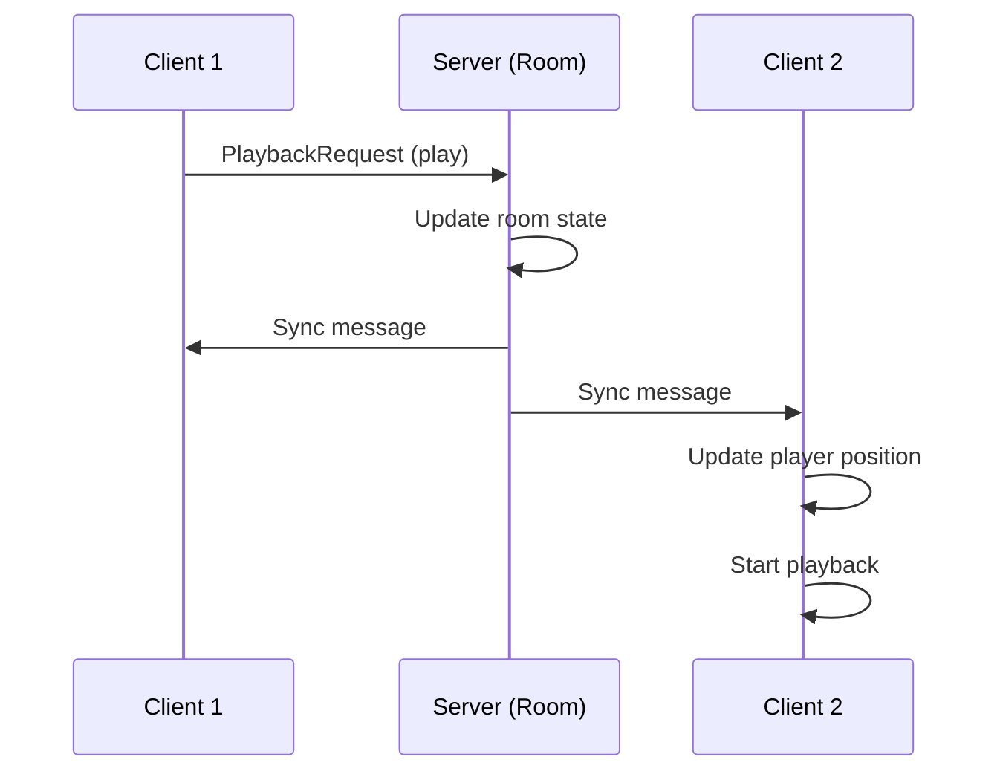

OpenTogetherTube's core feature is real-time video synchronization across all viewers in a room. This ensures everyone sees the same content at the same time, creating a true shared viewing experience.

## How It Works

### Architecture Overview



The server maintains the **authoritative state** and broadcasts changes to all connected clients.

## Playback State

### Core Properties

The room tracks these playback properties (see `server/room.ts:128`):

```typescript
interface RoomState {
  currentSource: QueueItem | null;    // Current video
  isPlaying: boolean;                  // Play/pause state
  playbackPosition: number;            // Position in seconds
  playbackSpeed: number;               // Speed multiplier (default: 1.0)
  _playbackStart: Dayjs | null;        // When playback started
}
```

### Calculated Position

The actual playback position is calculated on-demand:

```typescript
get realPlaybackPosition(): number {
  if (this._playbackStart && this.isPlaying) {
    return this.playbackPosition + this.calcDurationFromPlaybackStart();
  }
  return this.playbackPosition;
}

calcDurationFromPlaybackStart(): number {
  if (this._playbackStart !== null) {
    return calculateCurrentPosition(
      this._playbackStart,
      dayjs(),
      0,
      this.playbackSpeed
    );
  }
  return 0;
}
```

<Note>
  This approach minimizes drift by calculating position from a timestamp rather than incrementing a counter.
</Note>

## Playback Control

### Play/Pause

Clients send playback requests that the server processes:

```typescript
// Client sends request
const request: PlaybackRequest = {
  type: RoomRequestType.PlaybackRequest,
  state: true  // true = play, false = pause
};

// Server handles request (room.ts:1139)
async playback(request: PlaybackRequest, context: RoomRequestContext) {
  if (request.state) {
    await this.play();
  } else {
    await this.pause();
  }
  await this.publishRoomEvent(request, context);
}
```

### Play Implementation

```typescript
public async play(): Promise<void> {
  if (this.isPlaying) {
    this.log.silly("already playing");
    return;
  }
  this.log.debug("playback started");
  this.isPlaying = true;
  this._playbackStart = dayjs();  // Record start timestamp
}
```

### Pause Implementation

```typescript
public async pause(): Promise<void> {
  if (!this.isPlaying) {
    this.log.silly("already paused");
    return;
  }
  this.log.debug("playback paused");
  this.flushPlaybackPosition();  // Save current position
  this._playbackStart = null;
  this.isPlaying = false;
}
```

## Seeking

Seeking allows jumping to a specific position in the video:

```typescript
public async seek(request: SeekRequest, context: RoomRequestContext) {
  if (request.value === undefined || request.value === null) {
    this.log.error("seek value was undefined or null");
    return;
  }
  
  const prev = this.realPlaybackPosition;
  this.seekRaw(request.value);
  await this.publishRoomEvent(request, context, { prevPosition: prev });
  
  // Handle SponsorBlock segments
  const segment = this.getSegmentForTime(this.playbackPosition);
  if (segment !== undefined) {
    this.dontSkipSegmentsUntil = segment.endTime;
  } else {
    this.dontSkipSegmentsUntil = null;
  }
}

private seekRaw(value: number): void {
  counterSecondsWatched
    .labels({ service: this.currentSource?.service })
    .inc(this.calcDurationFromPlaybackStart());
  this.playbackPosition = value;
  this._playbackStart = dayjs();
}
```

<Warning>
  Seeking records watch time metrics before updating position to ensure accurate analytics.
</Warning>

## Playback Speed

Playback speed can be adjusted from 0.25x to 2x:

```typescript
public async setPlaybackSpeed(
  request: PlaybackSpeedRequest,
  context: RoomRequestContext
): Promise<void> {
  this.flushPlaybackPosition();  // Save position at current speed
  this.playbackSpeed = request.speed;
}
```

Position calculation accounts for playback speed:

```typescript
// From ott-common/timestamp.ts
export function calculateCurrentPosition(
  startTime: Dayjs,
  currentTime: Dayjs,
  startPosition: number,
  playbackSpeed: number
): number {
  const elapsedSeconds = currentTime.diff(startTime, "second", true);
  return startPosition + (elapsedSeconds * playbackSpeed);
}
```

## State Synchronization

### Sync Messages

When playback state changes, the server broadcasts sync messages:

```typescript
type ServerMessageSync = {
  action: "sync",
  isPlaying?: boolean,
  playbackPosition?: number,
  playbackSpeed?: number,
  currentSource?: QueueItem | null,
  // ... other room state
};
```

### Dirty Property Tracking

Rooms track which properties changed to minimize network traffic:

```typescript
private _dirty: Set<keyof RoomStateSyncable> = new Set();

private markDirty(prop: keyof RoomStateSyncable): void {
  this._dirty.add(prop);
  this.throttledSync();  // Debounced to 50ms
}

public async sync(): Promise<void> {
  if (this._dirty.size === 0) return;
  
  const state = this.syncableState();
  const msg = Object.assign(
    { action: "sync" },
    _.pick(state, Array.from(this._dirty))
  );
  
  await this.publish(msg);
  this.cleanDirty();
}
```

<Info>
  Sync is debounced to 50ms to batch rapid changes (e.g., dragging the seek bar).
</Info>

## Client-Side Synchronization

Clients receive sync messages and update their players:

```typescript
// In ServerMessageHandler.vue
function handleSync(msg: ServerMessageSync) {
  if (msg.playbackPosition !== undefined) {
    store.commit("PLAYBACK_POSITION", msg.playbackPosition);
  }
  if (msg.isPlaying !== undefined) {
    if (msg.isPlaying) {
      player.play();
    } else {
      player.pause();
    }
  }
  if (msg.playbackSpeed !== undefined) {
    player.setPlaybackSpeed(msg.playbackSpeed);
  }
}
```

## Initial Sync

When a client joins, they receive the full room state:

```typescript
// In clientmanager.ts:onClientAuth
const syncMsg = Object.assign(
  { action: "sync" },
  room.syncableState()
) as ServerMessageSync;

client.send(syncMsg);

// Then send current position as a separate message
await room.publish({
  action: "sync",
  playbackPosition: room.realPlaybackPosition
});
```

## Queue Management

### Auto-Advance

The room automatically advances to the next video when the current one ends:

```typescript
public async update(): Promise<void> {
  if (this.currentSource && this.isPlaying &&
      this.realPlaybackPosition > 
      (this.currentSource.endAt ?? this.currentSource.length ?? 0)) {
    counterMediaWatched
      .labels({ service: this.currentSource.service })
      .inc();
    await this.dequeueNext();
  }
}
```

### Dequeue Logic

```typescript
async dequeueNext() {
  if (this.enableVoteSkip) {
    this.votesToSkip.clear();
  }
  
  if (this.currentSource !== null) {
    // Queue mode handling
    if (this.queueMode === QueueMode.Dj) {
      this.playbackPosition = this.currentSource?.startAt ?? 0;
      this._playbackStart = dayjs();
      return;
    } else if (this.queueMode === QueueMode.Loop) {
      await this.queue.enqueue(this.currentSource);
    }
  }
  
  if (this.queue.length > 0) {
    this.currentSource = await this.queue.dequeue() ?? null;
    this.playbackPosition = this.currentSource?.startAt ?? 0;
    this._playbackStart = dayjs();
  } else {
    this.currentSource = null;
    this.isPlaying = false;
  }
  
  this.playbackSpeed = 1;
}
```

## Update Loop

The RoomManager runs an update loop every second:

```typescript
// In roommanager.ts
export async function update(): Promise<void> {
  for (const room of rooms) {
    await room.update();
    await room.sync();
  }
}

setInterval(update, 1000);
```

<Tip>
  The 1-second interval balances responsiveness with server load.
</Tip>

## Metrics

Playback events are tracked for analytics:

```typescript
const counterSecondsWatched = new Counter({
  name: "ott_media_seconds_played",
  help: "Seconds of media played",
  labelNames: ["service"]
});

const counterMediaWatched = new Counter({
  name: "ott_media_watched",
  help: "Videos watched to completion",
  labelNames: ["service"]
});

const counterMediaSkipped = new Counter({
  name: "ott_media_skipped",
  help: "Videos manually skipped",
  labelNames: ["service"]
});
```

## Handling Drift

### Client-Side Position Tracking

Clients calculate their expected position independently:

```typescript
// Client updates position based on server sync
const sliderPosition = computed(() => {
  if (!currentSource.value || !playbackStart.value) {
    return 0;
  }
  
  return calculateCurrentPosition(
    playbackStart.value,
    dayjs(),
    store.state.room.playbackPosition,
    store.state.room.playbackSpeed
  );
});
```

### Resync on Significant Drift

If client position drifts too far from server position, a resync is triggered (implementation in player components).

## WebSocket Communication

All synchronization happens over WebSocket connections:

```typescript
// Client → Server
interface ClientMessage {
  action: "req",
  request: RoomRequest  // PlaybackRequest, SeekRequest, etc.
}

// Server → Client
interface ServerMessage {
  action: "sync" | "event" | "chat" | "user",
  // ... message-specific fields
}
```

## Best Practices

<Steps>
  <Step title="Trust the Server">
    Always treat server state as authoritative. Client-side position is only for UI updates.
  </Step>
  
  <Step title="Minimize Sync Frequency">
    Use debouncing and dirty tracking to avoid flooding the network.
  </Step>
  
  <Step title="Handle Edge Cases">
    Account for playback speed, segment skipping, and queue mode changes.
  </Step>
  
  <Step title="Track Metrics">
    Record playback events for analytics and debugging.
  </Step>
</Steps>

## Related Features

<CardGroup cols={2}>
  <Card title="Room Management" icon="door-open" href="/features/rooms">
    Learn about room lifecycle and state management
  </Card>
  <Card title="Permissions" icon="shield" href="/features/permissions">
    Control who can manage playback
  </Card>
  <Card title="Vote to Skip" icon="forward-step" href="/features/voting">
    Democratic skip control
  </Card>
  <Card title="SponsorBlock" icon="forward" href="/features/sponsorblock">
    Automatic segment skipping during playback
  </Card>
</CardGroup>