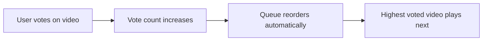

OpenTogetherTube provides two voting features: **Vote Mode** for democratic queue ordering and **Vote-to-Skip** for collective skip decisions.

## Vote Mode

In Vote Mode, the queue automatically reorders based on user votes. The most voted videos play first, creating a democratic playlist.

### How It Works



### Enabling Vote Mode

Set the queue mode to `vote`:

```typescript
PATCH /api/room/:name

{
  "queueMode": "vote"
}
```

Or via the room settings UI:

```typescript
enum QueueMode {
  Manual = "manual",  // Default: videos play in order added
  Vote = "vote",      // Videos ordered by vote count
  Loop = "loop",      // Videos re-queue after playing
  Dj = "dj"          // Current video restarts when finished
}
```

### Voting on Videos

Users with the `manage-queue.vote` permission can vote:

#### Add Vote

```http
POST /api/room/:name/vote

Content-Type: application/json
{
  "service": "youtube",
  "id": "dQw4w9WgXcQ"
}
```

#### Remove Vote

```http
DELETE /api/room/:name/vote

Content-Type: application/json
{
  "service": "youtube",
  "id": "dQw4w9WgXcQ"
}
```

### Implementation

#### Vote Storage

Votes are stored as a map of video IDs to client ID sets:

```typescript
class Room {
  // Map: "service+id" -> Set of client IDs who voted
  votes: Map<string, Set<ClientId>> = new Map();
  
  // Computed vote counts for syncing to clients
  get voteCounts(): Map<string, number> {
    const counts = new Map();
    for (const [vid, votes] of this.votes.entries()) {
      counts.set(vid, votes.size);
    }
    return counts;
  }
}
```

#### Processing Vote Requests

```typescript
public async vote(
  request: VoteRequest,
  context: RoomRequestContext
): Promise<void> {
  if (!context.clientId) {
    throw new OttException("Can't vote if not connected to room.");
  }
  
  const key = request.video.service + request.video.id;
  
  if (this.votes.has(key)) {
    const votes = this.votes.get(key)!;
    if (request.add) {
      votes.add(context.clientId);
    } else {
      votes.delete(context.clientId);
    }
  } else {
    if (request.add) {
      this.votes.set(key, new Set([context.clientId]));
    }
  }
  
  this.markDirty("voteCounts");
}
```

#### Automatic Reordering

The queue reorders on every update cycle:

```typescript
public async update(): Promise<void> {
  // Sort queue according to queue mode
  if (this.queueMode === QueueMode.Vote) {
    await this.queue.orderBy(
      [
        video => {
          const votes = this.votes.get(video.service + video.id);
          return votes ? votes.size : 0;
        }
      ],
      ["desc"]  // Descending order (most votes first)
    );
  }
  // ...
}
```

### Vote Cleanup

When users leave, their votes are removed:

```typescript
public async leaveRoom(
  request: LeaveRequest,
  context: RoomRequestContext
): Promise<void> {
  // ... other leave logic
  
  if (this.queueMode === QueueMode.Vote) {
    this.votes.forEach(value => {
      if (value.delete(removed.id)) {
        this.markDirty("voteCounts");
      }
    });
  }
}
```

### UI Integration

Vote counts are displayed in the queue:

```vue
<template>
  <div class="queue-item">
    <span>{{ video.title }}</span>
    <v-chip v-if="voteCount > 0">
      <v-icon :icon="mdiThumbUp" />
      {{ voteCount }}
    </v-chip>
  </div>
</template>

<script setup>
const voteCount = computed(() => {
  const key = props.video.service + props.video.id;
  return store.state.room.voteCounts.get(key) ?? 0;
});
</script>
```

## Vote-to-Skip

Vote-to-Skip allows users to collectively decide when to skip the current video.

### How It Works

<Steps>
  <Step title="User Votes to Skip">
    User clicks the skip button (adds vote)
  </Step>
  
  <Step title="Threshold Check">
    Server checks if enough users voted (≥50% of eligible voters)
  </Step>
  
  <Step title="Auto-Skip">
    When threshold is met, video automatically skips
  </Step>
  
  <Step title="Reset">
    Vote counts reset when new video starts
  </Step>
</Steps>

### Enabling Vote-to-Skip

```typescript
PATCH /api/room/:name

{
  "enableVoteSkip": true
}
```

Or via the room settings UI:

```vue
<v-checkbox
  v-model="settings.enableVoteSkip.value"
  :label="$t('room-settings.enable-vote-skip')"
  :disabled="!granted('configure-room.other')"
/>
```

### Skip Threshold

The threshold is 50% of eligible voters:

```typescript
// From common/voteskip.ts
export function voteSkipThreshold(users: number): number {
  return Math.ceil(users * 0.5);
}

export function countEligibleVoters(
  users: RoomUserInfo[],
  grants: Grants
): number {
  let count = 0;
  for (const user of users) {
    if (grants.granted(user.role, "playback.skip")) {
      count++;
    }
  }
  return count;
}
```

<Note>
  Only users with the `playback.skip` permission count toward the threshold. This prevents abuse from users without skip permission.
</Note>

### Implementation

#### Vote Storage

```typescript
class Room {
  votesToSkip: Set<string> = new Set();  // Client IDs
  enableVoteSkip: boolean = false;
}
```

#### Skip Request Handling

```typescript
public async skip(
  request: SkipRequest,
  context: RoomRequestContext
): Promise<void> {
  if (!this.currentSource) return;
  
  let shouldSkip = false;
  
  if (this.enableVoteSkip) {
    if (context.clientId) {
      // Toggle vote
      if (this.votesToSkip.has(context.clientId)) {
        this.votesToSkip.delete(context.clientId);
      } else {
        this.votesToSkip.add(context.clientId);
      }
      this.markDirty("votesToSkip");
    }
    
    // Check threshold
    const eligibleUsers = countEligibleVoters(
      this.realusers.map(u => this.getUserInfo(u.id)),
      this.grants
    );
    if (this.votesToSkip.size >= voteSkipThreshold(eligibleUsers)) {
      shouldSkip = true;
    }
  } else {
    // Instant skip if vote-to-skip is disabled
    shouldSkip = true;
  }
  
  if (shouldSkip) {
    const current = this.currentSource;
    const prevPosition = this.realPlaybackPosition;
    
    counterMediaSkipped
      .labels({ service: this.currentSource.service })
      .inc();
    
    this.dequeueNext();
    await this.publishRoomEvent(request, context, {
      video: current,
      prevPosition
    });
    this.videoSegments = [];
  }
}
```

#### Vote Reset

Votes reset when a new video starts:

```typescript
async dequeueNext() {
  if (this.enableVoteSkip) {
    this.votesToSkip.clear();
    this.markDirty("votesToSkip");
  }
  // ... dequeue logic
}
```

#### Cleanup on Leave

Remove user's skip vote when they disconnect:

```typescript
public async leaveRoom(
  request: LeaveRequest,
  context: RoomRequestContext
): Promise<void> {
  // ... other leave logic
  
  if (this.enableVoteSkip) {
    this.votesToSkip.delete(context.clientId);
    this.markDirty("votesToSkip");
  }
}
```

### UI Component

The `VoteSkip.vue` component displays the vote progress:

```vue
<template>
  <v-banner
    v-if="store.state.room.enableVoteSkip && shouldShow"
    class="vote-skip-banner"
  >
    <template #text>
      <v-progress-linear
        :model-value="votePercentage"
        height="30"
        color="primary"
      >
        {{ votesNeeded }} / {{ threshold }} votes to skip
      </v-progress-linear>
    </template>
  </v-banner>
</template>

<script setup>
const votesNeeded = computed(() => {
  return store.state.room.votesToSkip?.size ?? 0;
});

const eligibleVoters = computed(() => {
  return countEligibleVoters(
    Array.from(store.state.users.users.values()),
    store.state.room.grants
  );
});

const threshold = computed(() => {
  return voteSkipThreshold(eligibleVoters.value);
});

const votePercentage = computed(() => {
  return (votesNeeded.value / threshold.value) * 100;
});
</script>
```

### State Synchronization

Vote-to-skip state is synchronized to clients:

```typescript
// In room.ts syncableProps
const syncableProps: (keyof RoomStateSyncable)[] = [
  // ... other props
  "enableVoteSkip",
  "votesToSkip",
];
```

Clients receive updates:

```typescript
interface ServerMessageSync {
  action: "sync";
  enableVoteSkip?: boolean;
  votesToSkip?: Set<ClientId>;
  // ...
}
```

## Combining Vote Mode and Vote-to-Skip

Both features can be enabled simultaneously:

- **Vote Mode**: Determines queue order based on votes
- **Vote-to-Skip**: Requires collective decision to skip current video

This creates a fully democratic room where users vote on what to watch and when to skip.

## Permissions

Voting requires specific permissions:

| Feature | Required Permission | Default Access |
|---------|--------------------|-----------------|
| Vote on queue items | `manage-queue.vote` | UnregisteredUser |
| Skip/vote-to-skip | `playback.skip` | UnregisteredUser |

Room owners can restrict voting to registered or trusted users:

```typescript
// Only let registered users vote
grants.setRoleGrants(Role.UnregisteredUser, parseIntoGrantMask([
  "playback",
  "manage-queue.add",
  // Omit manage-queue.vote
]));
```

## Best Practices

<Steps>
  <Step title="Start with Vote Mode">
    Enable vote mode for community rooms to give everyone a voice.
  </Step>
  
  <Step title="Add Vote-to-Skip">
    Enable vote-to-skip to prevent one person from holding the room hostage.
  </Step>
  
  <Step title="Adjust Permissions">
    Restrict voting to registered users if spam becomes an issue.
  </Step>
  
  <Step title="Monitor Usage">
    Check vote patterns to understand your community's preferences.
  </Step>
</Steps>

## Limitations

<Warning>
  Vote data is not persisted across room unloads. When a room unloads, all votes are lost.
</Warning>

<Note>
  Vote-to-skip votes are per-video. They reset when the video changes, not when users change their vote.
</Note>

## API Reference

### Vote on Queue Item

```http
POST /api/room/:name/vote
DELETE /api/room/:name/vote

Content-Type: application/json
{
  "service": "youtube" | "vimeo" | "dailymotion" | "direct",
  "id": "video_id"
}
```

**Response:**
```json
{
  "success": true
}
```

### Skip Request (WebSocket)

```typescript
// Client -> Server
{
  action: "req",
  request: {
    type: RoomRequestType.SkipRequest
  }
}

// Server -> All Clients (if skip succeeds)
{
  action: "event",
  request: { type: RoomRequestType.SkipRequest },
  user: { id: "...", name: "...", ... },
  additional: {
    video: { service: "youtube", id: "...", ... },
    prevPosition: 42.5
  }
}
```

## Related Features

<CardGroup cols={2}>
  <Card title="Room Management" icon="door-open" href="/features/rooms">
    Queue modes and room configuration
  </Card>
  <Card title="Permissions" icon="shield" href="/features/permissions">
    Control who can vote and skip
  </Card>
  <Card title="Video Sync" icon="arrows-rotate" href="/features/video-sync">
    How skip events synchronize playback
  </Card>
</CardGroup>